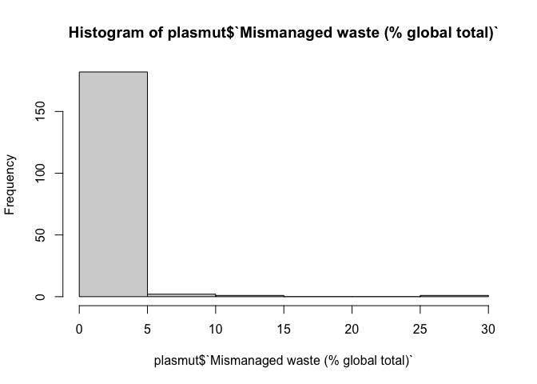
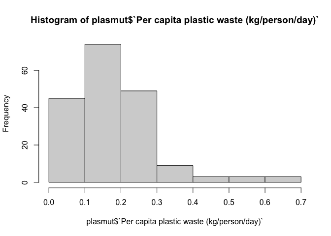
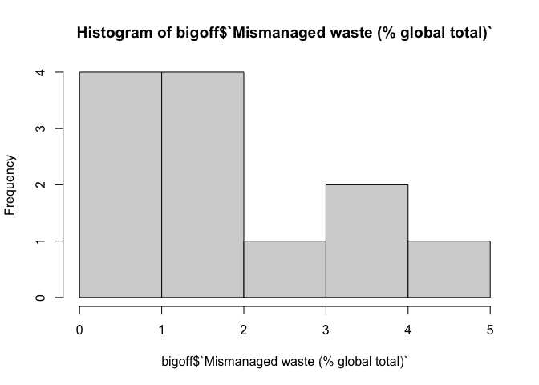
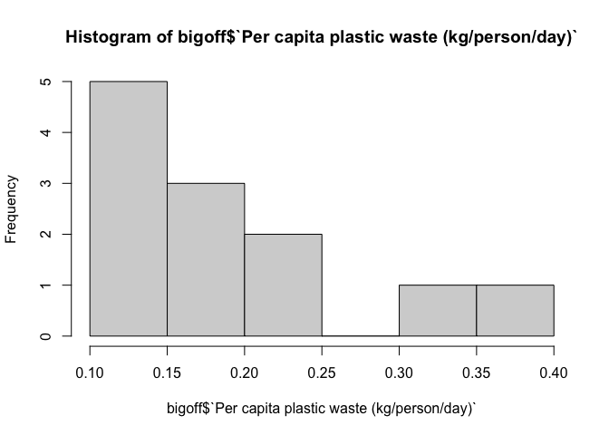

Kaggle_Project2
================
Hollismc
2022-04-05

## Introduction

This dataset was gathered from Our World in Data from their article
“Plastic Pollution”. The authors inspiration for the data set was to
show how much plastic we use per day. This analysis will visualize how
much plastic is produced and how much plastic we use and discard
overall. Then we ask what countries are above the mean in both
mismanaged waste and per capita usage of plastic? While the authors
don’t exactly define what mismanaged waste is we surmise that it is the
amount of plastic being dumped in the ocean. They state that “More and
more plastic is being generated every year and more of which is getting
dumped into the ocean or is mishandled”.

## Libraries

``` r
library(dplyr)
```

    ## 
    ## Attaching package: 'dplyr'

    ## The following objects are masked from 'package:stats':
    ## 
    ##     filter, lag

    ## The following objects are masked from 'package:base':
    ## 
    ##     intersect, setdiff, setequal, union

``` r
library(tidyverse)
```

    ## ── Attaching packages ─────────────────────────────────────── tidyverse 1.3.1 ──

    ## ✓ ggplot2 3.3.5     ✓ purrr   0.3.4
    ## ✓ tibble  3.1.6     ✓ stringr 1.4.0
    ## ✓ tidyr   1.2.0     ✓ forcats 0.5.1
    ## ✓ readr   2.1.2

    ## ── Conflicts ────────────────────────────────────────── tidyverse_conflicts() ──
    ## x dplyr::filter() masks stats::filter()
    ## x dplyr::lag()    masks stats::lag()

``` r
library(ggplot2)
library(readr)
```

## Download Data

``` r
plastpro <- read_csv("archive-2/global-plastics-production.csv")
```

    ## Rows: 66 Columns: 4
    ## ── Column specification ────────────────────────────────────────────────────────
    ## Delimiter: ","
    ## chr (2): Entity, Code
    ## dbl (2): Year, Global plastics production (million tonnes)
    ## 
    ## ℹ Use `spec()` to retrieve the full column specification for this data.
    ## ℹ Specify the column types or set `show_col_types = FALSE` to quiet this message.

``` r
mismanplast <- read_csv("archive-2/mismanaged-waste-global-total.csv")
```

    ## Rows: 186 Columns: 4
    ## ── Column specification ────────────────────────────────────────────────────────
    ## Delimiter: ","
    ## chr (2): Entity, Code
    ## dbl (2): Year, Mismanaged waste (% global total)
    ## 
    ## ℹ Use `spec()` to retrieve the full column specification for this data.
    ## ℹ Specify the column types or set `show_col_types = FALSE` to quiet this message.

``` r
plastwstpercap <- read_csv("archive-2/plastic-waste-per-capita.csv")
```

    ## Rows: 186 Columns: 4
    ## ── Column specification ────────────────────────────────────────────────────────
    ## Delimiter: ","
    ## chr (2): Entity, Code
    ## dbl (2): Year, Per capita plastic waste (kg/person/day)
    ## 
    ## ℹ Use `spec()` to retrieve the full column specification for this data.
    ## ℹ Specify the column types or set `show_col_types = FALSE` to quiet this message.

``` r
str(plastpro)
```

    ## spec_tbl_df [66 × 4] (S3: spec_tbl_df/tbl_df/tbl/data.frame)
    ##  $ Entity                                     : chr [1:66] "World" "World" "World" "World" ...
    ##  $ Code                                       : chr [1:66] "OWID_WRL" "OWID_WRL" "OWID_WRL" "OWID_WRL" ...
    ##  $ Year                                       : num [1:66] 1950 1951 1952 1953 1954 ...
    ##  $ Global plastics production (million tonnes): num [1:66] 2e+06 2e+06 2e+06 3e+06 3e+06 4e+06 5e+06 5e+06 6e+06 7e+06 ...
    ##  - attr(*, "spec")=
    ##   .. cols(
    ##   ..   Entity = col_character(),
    ##   ..   Code = col_character(),
    ##   ..   Year = col_double(),
    ##   ..   `Global plastics production (million tonnes)` = col_double()
    ##   .. )
    ##  - attr(*, "problems")=<externalptr>

``` r
str(mismanplast)
```

    ## spec_tbl_df [186 × 4] (S3: spec_tbl_df/tbl_df/tbl/data.frame)
    ##  $ Entity                           : chr [1:186] "Albania" "Algeria" "Angola" "Anguilla" ...
    ##  $ Code                             : chr [1:186] "ALB" "DZA" "AGO" "AIA" ...
    ##  $ Year                             : num [1:186] 2010 2010 2010 2010 2010 2010 2010 2010 2010 2010 ...
    ##  $ Mismanaged waste (% global total): num [1:186] 0.0933 1.6347 0.1964 0.0002 0.0039 ...
    ##  - attr(*, "spec")=
    ##   .. cols(
    ##   ..   Entity = col_character(),
    ##   ..   Code = col_character(),
    ##   ..   Year = col_double(),
    ##   ..   `Mismanaged waste (% global total)` = col_double()
    ##   .. )
    ##  - attr(*, "problems")=<externalptr>

``` r
str(plastwstpercap)
```

    ## spec_tbl_df [186 × 4] (S3: spec_tbl_df/tbl_df/tbl/data.frame)
    ##  $ Entity                                  : chr [1:186] "Albania" "Algeria" "Angola" "Anguilla" ...
    ##  $ Code                                    : chr [1:186] "ALB" "DZA" "AGO" "AIA" ...
    ##  $ Year                                    : num [1:186] 2010 2010 2010 2010 2010 2010 2010 2010 2010 2010 ...
    ##  $ Per capita plastic waste (kg/person/day): num [1:186] 0.069 0.144 0.062 0.252 0.66 0.183 0.252 0.112 0.39 0.132 ...
    ##  - attr(*, "spec")=
    ##   .. cols(
    ##   ..   Entity = col_character(),
    ##   ..   Code = col_character(),
    ##   ..   Year = col_double(),
    ##   ..   `Per capita plastic waste (kg/person/day)` = col_double()
    ##   .. )
    ##  - attr(*, "problems")=<externalptr>

We begin our analysis with a simple graph of global plastics production
to show its dramatic rise from 1950 to 2015. We will then look at waste
per capita and what the mismanagement of that waste means to our
environment. We are limited to one year (2010) of data for plastic
mismanagement and plastic waste per capita, but will be advised by the
global plastics production’s upward trajectory and trends for
mismanagement and consumption. We will identify those contries that
contribute and mismanage more than the mean.

``` r
plastprodat <- plastpro %>% select(Year, `Global plastics production (million tonnes)`)
 plastplot <- ggplot(data = plastprodat, aes(plastprodat$Year, plastprodat$`Global plastics production (million tonnes)`)) +
            geom_point() +
            geom_abline() +
            labs(x="Year", y = "Global Plastics Production", title = "Global Plastics Production
                 In Million Tonnes")
```

## Combine the data necessary into one data set

``` r
mismanplastdat <- mismanplast %>% select(Entity, `Mismanaged waste (% global total)`)
plastwstpercapdat  <- plastwstpercap %>% select(Entity, `Per capita plastic waste (kg/person/day)`)
plasmut <- right_join(mismanplastdat, plastwstpercapdat)
```

    ## Joining, by = "Entity"

``` r
hist(plasmut$`Mismanaged waste (% global total)`)
```

<!-- -->

``` r
hist(plasmut$`Per capita plastic waste (kg/person/day)`)
```

<!-- --> \##
filter out countries greater than the mean to identify the biggest
offenders

``` r
plwstpcdatmean <- mean(plastwstpercapdat$`Per capita plastic waste (kg/person/day)`)
mismanmean <- mean(mismanplastdat$`Mismanaged waste (% global total)`)
bigoff <- plasmut %>% filter(`Mismanaged waste (% global total)`> mean(`Mismanaged waste (% global total)`)) %>% filter(`Per capita plastic waste (kg/person/day)`> mean(`Per capita plastic waste (kg/person/day)`)) %>% select(Entity, `Mismanaged waste (% global total)`, `Per capita plastic waste (kg/person/day)`)
hist(bigoff$`Mismanaged waste (% global total)`)
```

<!-- -->

``` r
hist(bigoff$`Per capita plastic waste (kg/person/day)`)
```

<!-- --> \##
Biggest Per Capita waste by Country in 2010

``` r
bigoffplot <- ggplot(bigoff, aes(Entity, bigoff$`Per capita plastic waste (kg/person/day)`)) +
        geom_point() +
        labs(x="Country", y="Per Capita Plastic Waste (kg/person/day)", title = "Biggest Per Capita Waste by Country 2010")
```

## Biggest Mismanaged Waste by Country in 2010

``` r
bigoffplot_2 <- ggplot(bigoff, aes(Entity, bigoff$`Mismanaged waste (% global total)`)) +
        geom_point() +
        labs(x="Country", y= "Mismanaged waste (% global total)", title= "Most Mismanaged Waste as a % of the Global Total (2010)")
```

## Conclusion

This analysis shows that the largest problem is the steep upward
trajectory of global plastics production and the world’s inability to
dispose of it in a sustainable manner. In the histograms showing global
totals of mismanaged waste(% global total), the first histogram shows a
high concentration in about 5% of the global total, with a range from 0
to 30%. We then look at only those countries with an above the mean
percentage of the global total. This second histogram shows a range for
mismanaged waste from 0 to 5% for this population, with a higher
concentration in 0 to 2% of this population, but with predictably higher
frequencies across all categories than the first histogram.

In the second set of histograms plotting per capita plastic waste
(kg/person/day) the results show that on a global basis, each person
uses between 0.0 to 0.7 kg/person/day, with the largest concentration
around 0.0 to 0.3 kg/person/day. When we again pull out the above the
mean users, we see that the per capita plastic waste (kg/person/day)
goes from 0.1 to 0.4 kg/person/day, with the highest concentration being
from 0.1 to .25 kg/person/day.

Lastly, we plot the biggest offenders for both per capita plastic and
mismanagement to show the top offender for both categories is Sri Lanka.
The United States comes in second for plastic waste, and Thailand come
second for mismanaged waste.
